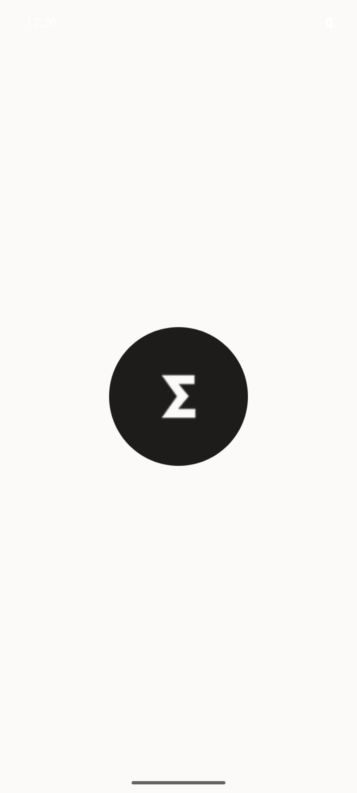
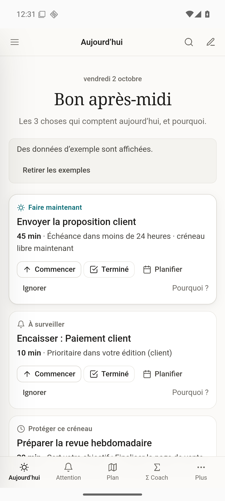
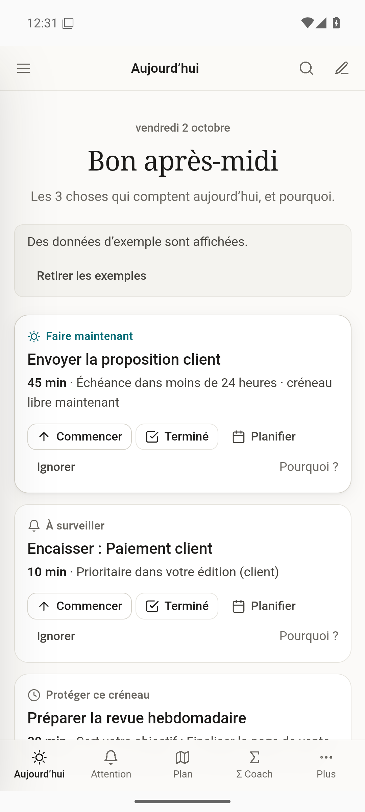
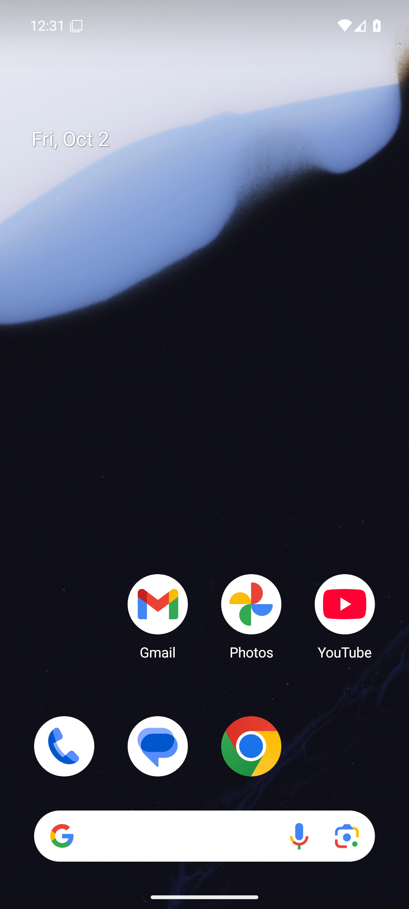
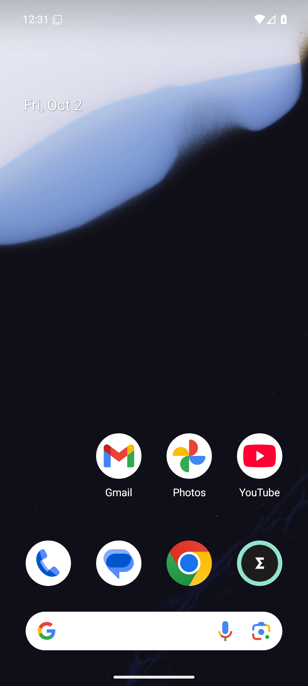

# NEXT — test Android (sdk_gphone64_x86_64)

- ✅ opens on the app, not the landing page — `https://localhost/`
- ✅ Today shows three decisions
- ✅ attention renders
- ✅ plan renders
- ✅ coach renders
- ❌ back button goes back inside the app — `#coach`
- ❌ test ran to the end — `locator.fill: Timeout 30000ms exceeded. | Call log: |   - waiting for locator('.composer textarea, .composer input').first() |     - locator resolved to <textarea rows="1" maxlength="1000" enterkeyhint="done" aria-label="Capture rapide" aria-describedby="composer-preview" placeholder="Tâche, rendez-vous, question… ex. « déjeuner vendredi 13h avec Marc »"></textarea>`

